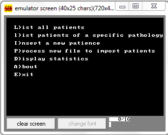
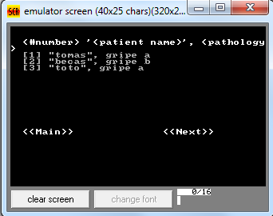
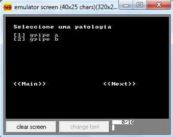
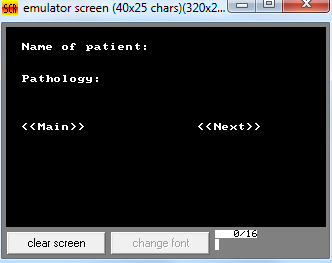
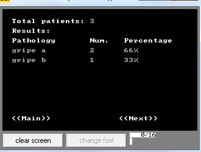

# Uni-Medical-Database
Medical database managment system.

This system contains the following operations:

* It works as a “database” of patients.
* Imports patient data from file.
* Generates statistics of the most relevant type of pathologies (i.e. the pathologies with more patients).

System description:
On startup the program loads the previous database from the file “database.dmp” and presents a menu that has the following mouse-selectable options: 

[comment]: <> (  )

Operations description: 

__L)ist patients__ - lists in the monitor all the patients stores in the database with the following format:  
\<#number\> \<patient name\>, \<pathology\>  
example:  

__l)ist patients of a specific pathology__ - lists in the monitor all the patients classified with a specific pathology. Selection of the pathology with the mouse.  
\<Selected Pathology\>  
\<#number\> ”\<patient name\>”  
Example:  

__(I)nsert a new patient__ - Input for new patient  

  

__P)rocess new file to import patients__ - asks to the user the path name to a file with the new patients and adds all new patient to the database. The patients are identified with the label PAT and terminated with “:”
Example:

The file:
Lorem ipsum dolor sit amet, PAT Mark Anthony:Pathology 4: elit. In vel ipsum
eget erat ultrices molestie. Duis eu elit nulla. Ut sagittis vestibulum sem. Sed
eleifend, nunc PAT Tom Carr:Pathology 1:
adds:
Mark Anthony:Pathology 4
Tom Carr:Pathology 1

__D)isplay statistics__ - The program displays the statistics as depicted below and waits for a key or mouse button to be pressed before returning to the main menu (integer percentages).
Example:

__A)bout__ - presents addictional information.

__E)xit__ - terminates the program and returns to the operating system. It also stores all database data in the file “database.dmp”. Not in text. It is a dump of memory. It also stores the statistics of the most relevant pathologies in text format, in a file named “statistics.txt”.
